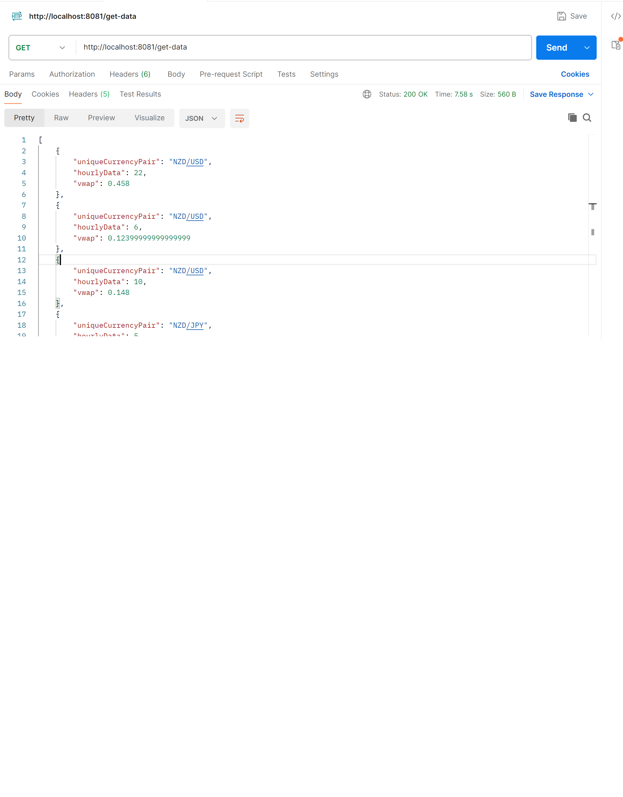

Pre-Requisites
==============
- Java 8 or higher
- Maven 
- Spring Boot
- Postman (for testing the endpoints)
- MySQL or PostgreSQL(or the database of your choice)

Database Configuration
==========================
This project uses a relational database. The scripts for creating tables and inserting test data are provided in the /data-script/ directory. Please execute these scripts to set up the required database before running the application.

Steps to set up the database:
- Navigate to the /data-script/ folder.
- Execute the provided SQL scripts in PostgreSQL.

Running the Application in Eclipse
====================================
1. Clone this repository to your local machine.

      git clone https://github.com/Any22/vwap-calculation-task.git
2. Import the project into Eclipse:

- Open Eclipse.
- Go to File > Import > Maven > Existing Maven Projects.
- Browse to the location of the project and click Finish.
- Set up the database properties in the application.yml or application.properties file.
- Right-click on the project, select Run As > Spring Boot App.

Testing the Endpoints via Postman
==================================
Once the application is running, you can test the various endpoints via Postman.

Steps to test:

- Send requests: The base URL for the application is :     http://localhost:8080.
- endpoint:     /get-data

Method:    GET
- Description: Fetches the price data and calculates VWAP.

Example Requests
================
GET /get-data
Fetches the price data with VWAP calculations for unique currency pair hourly .

Running the Application
=======================
Here is an example of the application in action:

Error Handling
===============
The application includes custom exception handling. If no data is found, the NoDataFoundException will be thrown, which returns a 404 status. Other exceptions are handled by the global exception handler, returning the appropriate error message and status code.

